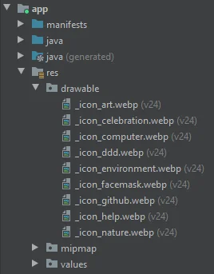
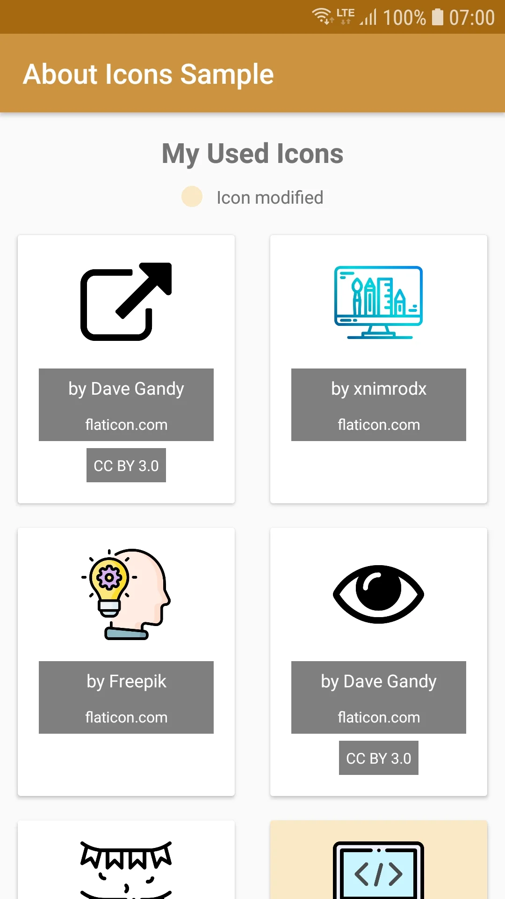
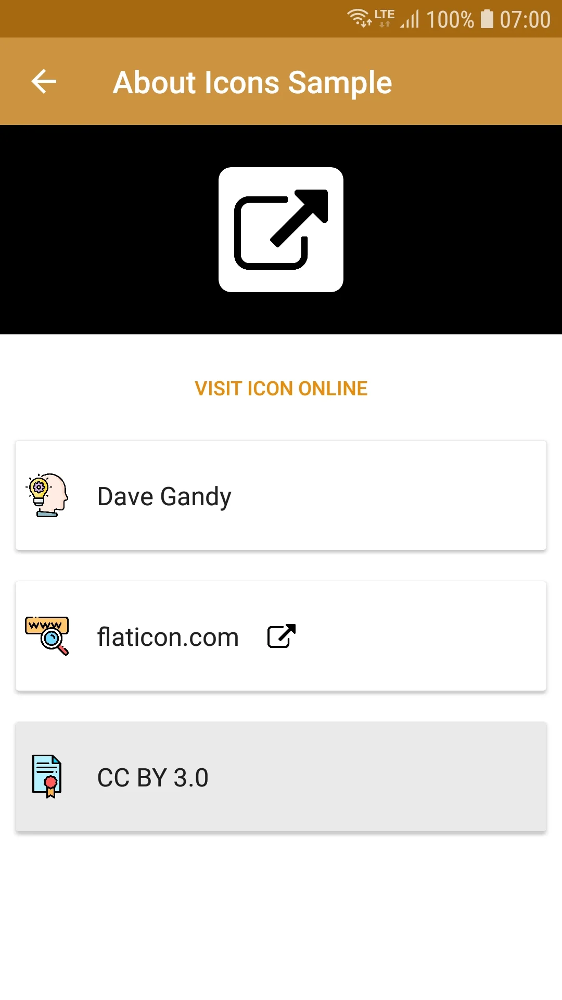
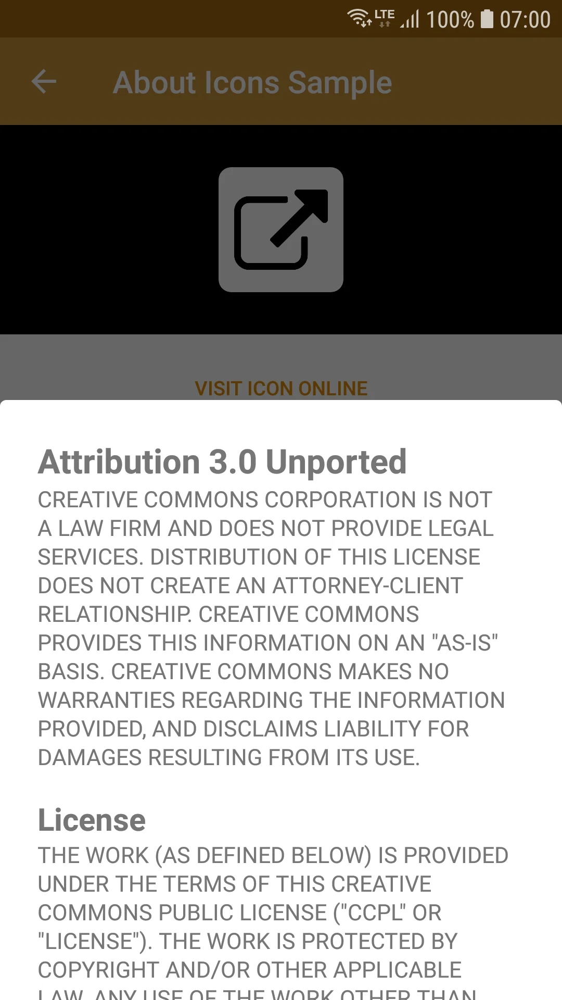

# Android About Icons Library
[](https://android-arsenal.com/api?level=24)
[](https://jitpack.io/#cyb3rko/about-icons)
[](https://github.com/cyb3rko/about-icons/commits/master)
[](https://www.apache.org/licenses/LICENSE-2.0)

- [About this project](#about-this-project)  
- [Features](#features)  
- [How to use](#how-to-use)  
- [Planned improvements](#planned-improvements)  
- [Screenshots](#screenshots)  
- [Contribute](#contribute)  
- [Apps using this library](#apps-using-this-library)  
- [License](#license)  

---

## About this project
This Android library simplifies the exhausting process of giving credits to licensed icons which require attribution (like icons from [flaticon.com](https://flaticon.com) or [fontawesome.com](https://fontawesome.com) in the free plan).

YOU CAN **DOWNLOAD** THE **SAMPLE APP** [HERE](https://github.com/cyb3rko/about-icons/raw/master/.github//Sample%20App/AboutIconsSample%20v1.2.1.apk)

This is my very first library and I'm still a student so the progress might not be as fast as on other projects.

## Features
- automatically recognizing the icons to show based on file name (further information [here](#2-mark-icons))
- automatically retrieving the information and credits by reading related string arrays (further information [here](#3-add-information))
- automatically highlight icons who have been modified by reading related string entry (further information [here](#3-add-information))

## How to use

### 1. Implementation
Add this to your **root** build.gradle file:
```gradle
allprojects {
  repositories {
    maven { url "https://jitpack.io" }
  }
}
```

Then add this to your **module's** build.gradle file:
```gradle
dependencies {
  implementation 'com.github.cyb3rko:about-icons:1.1.1'
}
```

### 2. Mark icons
Afterwards you have to add an underscore to every icon filename you want the library to attribute.  
If you don't add an underscore, the icon is ignored.

**Example**:  

          
### 3. Add information
Now you have to add the information the library needs for attributing.  
Do this by adding a string array for each icon with the icon name as string array name (**without** the underscore; it doesn't matter in which .xml file):
- author name (should be added)
- website (should be added)
- link to the used icon (should be added)
- boolean if icon was modified (default is *false*)
- icon license (currently supported licenses (if you are missing one, please [open an issue](https://github.com/cyb3rko/about-icons/issues/new))): 
  - [apache_2.0](https://www.apache.org/licenses/LICENSE-2.0)
  - [mit](https://opensource.org/licenses/MIT)
  - [cc_by_3.0](https://creativecommons.org/licenses/by/3.0/)
  - [cc_by_sa_3.0](https://creativecommons.org/licenses/by-sa/3.0/)
  - [cc_by_4.0](https://creativecommons.org/licenses/by/4.0/)
  - [cc_by_sa_4.0](https://creativecommons.org/licenses/by-sa/4.0/)

```xml
<?xml version="1.0" encoding="utf-8"?>
<resources>
    <string-array name="icon_alink">
        <item>Dave Gandy</item>
        <item>flaticon.com</item>
        <item>https://www.flaticon.com/free-icon/external-link-symbol_25284</item>
        <item>false</item>
        <item>cc_by_3.0</item>
    </string-array>

    <string-array name="icon_art">
        <item>xnimrodx</item>
        <item>flaticon.com</item>
        <item>https://www.flaticon.com/free-icon/computer_2905155</item>
    </string-array>
    ...
</resources>
```

### 4. Create view
At last just create a new `AboutIcons` object, pass the context and the drawable class, and get the view by calling `get()`.  
Optionally you can configure your AboutIcons page using following config methods:
```java
.setTitle("Your Title")
.hideModificationAnnotation()
```
*HINT*: If you want to hide the title, simply call "setTitle("")", then the title layout will be hidden

**Simple example for an activity**:
Kotlin
```kotlin
override fun onCreate(savedInstanceState: Bundle?) {
    super.onCreate(savedInstanceState);
    setContentView(AboutIcons(this, R.drawable::class.java).get());
}
```
Java
```java
@Override
protected void onCreate(Bundle savedInstanceState) {
    super.onCreate(savedInstanceState);
    setContentView(new AboutIcons(this, R.drawable.class).get());
}
```

**Advanced example (using configuration) for an activity**:<br/>
Kotlin:
```kotlin
override fun onCreate(savedInstanceState: Bundle?) {
    super.onCreate(savedInstanceState);
    
    val aboutIcons = AboutIcons(this, R.drawable::class.java)
            .setTitle("Your Title")
            .hideModificationAnnotation();

    setContentView(aboutIcons.get());
}
```
Java:
```java
@Override
protected void onCreate(Bundle savedInstanceState) {
    super.onCreate(savedInstanceState);
    
    AboutIcons aboutIcons = new AboutIcons(this, R.drawable.class)
            .setTitle("Your Title")
            .hideModificationAnnotation();

    setContentView(aboutIcons.get());
}
```

## Planned improvements
- improving scroll performance
- improving info activity performance by moving heavy methods to coroutines
- adding dark mode
- adding simple licensing information for several icon library websites

## Screenshots
||||
|:---:|:---:|:---:|

## Contribute
Of course I'm happy about any kind of contribution.

Feel free to open [issues](https://github.com/cyb3rko/about-icons/issues) for new features or bug reports.
If you want to directly contribute code just open [pull requests](https://github.com/cyb3rko/about-icons/pulls).

## Apps using this library
*If you want to add an app here, just open a [new issue](https://github.com/cyb3rko/about-icons/issues/new) / [PR](https://github.com/cyb3rko/about-icons/compare).*

<details>
  <summary><strong>Click here to see the list</strong></summary>
<br>
<table>
  <tr>
    <td><a href="https://github.com/cyb3rko/logviewer-for-openhab-app"></a></td>
    <td><a href="https://github.com/cyb3rko/logviewer-for-openhab-app">LogViewer for openHAB</a></td>
    <td>by <a href="https://github.com/cyb3rko">Cyb3rko</a></td>
  </tr>
</table>
</details>

## Used Libraries

<table>
  <tr>
    <td><a href="https://github.com/GrenderG/Toasty">Toasty</a></td>
    <td>by <a href="https://github.com/GrenderG">GrenderG</a></td>
    <td>licensed under <a href="https://github.com/GrenderG/Toasty/blob/master/LICENSE">GNU Lesser General Public License v3.0</a>
  </tr>
  <tr>
    <td><a href="https://github.com/afollestad/material-dialogs">Material Dialogs</a></td>
    <td>by <a href="https://github.com/afollestad">Aidan Follestad</a></td>
    <td>licensed under <a href="https://github.com/afollestad/material-dialogs/blob/master/LICENSE.md">Apache License 2.0</a>
  </tr>
</table>

## Used Icons

<table>
  <tr>
    <td><a href="https://www.flaticon.com/free-icon/idea_2628882"></a></td>
    <td>Icon made by <a href="https://www.flaticon.com/authors/freepik" title="Freepik">Freepik</a> from <a href="https://www.flaticon.com/" title="Flaticon">www.flaticon.com</a></td>
  </tr>
  <tr>
    <td><a href="https://www.flaticon.com/free-icon/file_1179182"></a></td>
    <td>Icon made by <a href="https://www.flaticon.com/authors/freepik" title="Freepik">Freepik</a> from <a href="https://www.flaticon.com/" title="Flaticon">www.flaticon.com</a></td>
  </tr>
  <tr>
    <td><a href="https://www.flaticon.com/free-icon/external-link-symbol_25284"></a></td>
    <td>Icon made by <a href="https://www.flaticon.com/authors/dave-gandy" title="Dave Gandy">Dave Gandy</a> from <a href="https://www.flaticon.com/" title="Flaticon">www.flaticon.com</a></td>
  </tr>
  <tr>
    <td><a href="https://www.flaticon.com/free-icon/wrench_2979591"></a></td>
    <td>Icon made by <a href="https://www.flaticon.com/authors/freepik" title="Freepik">Freepik</a> from <a href="https://www.flaticon.com/" title="Flaticon">www.flaticon.com</a></td>
  </tr>
  <tr>
    <td><a href="https://www.flaticon.com/free-icon/www_1150626"></a></td>
    <td>Icon made by <a href="https://www.flaticon.com/authors/freepik" title="Freepik">Freepik</a> from <a href="https://www.flaticon.com/" title="Flaticon">www.flaticon.com</a></td>
  </tr>
</table>

## License

    Copyright 2020 cyb3rko

    Licensed under the Apache License, Version 2.0 (the "License");
    you may not use this file except in compliance with the License.
    You may obtain a copy of the License at
    
        http://www.apache.org/licenses/LICENSE-2.0

    Unless required by applicable law or agreed to in writing, software
    distributed under the License is distributed on an "AS IS" BASIS,
    WITHOUT WARRANTIES OR CONDITIONS OF ANY KIND, either express or implied.
    See the License for the specific language governing permissions and
    limitations under the License.
