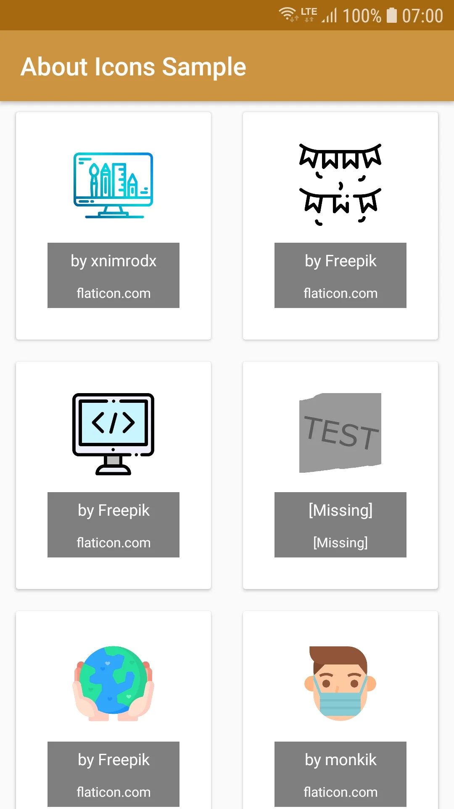
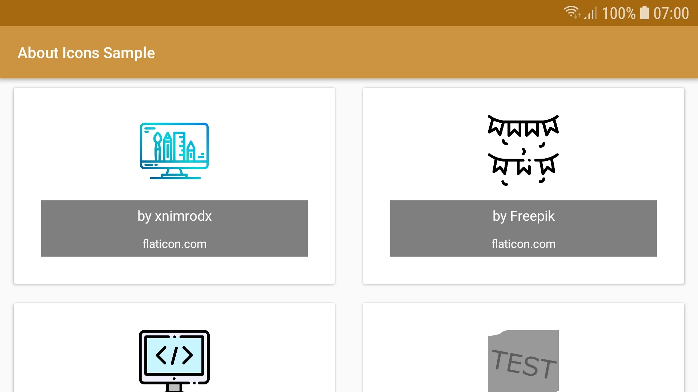

# Android About Icons Library
[](https://android-arsenal.com/api?level=23)
[](https://jitpack.io/#cyb3rko/about-icons)
[](https://github.com/cyb3rko/about-icons/commits/master)
[](https://www.apache.org/licenses/LICENSE-2.0)

- [About this project](#about-this-project)  
- [Features](#features)  
- [How to use](#how-to-use)  
  - [Implementation](#1-implementation)  
  - [Mark icons](#2-mark-icons)  
  - [Add information](#3-add-information)  
  - [Create view](#4-create-view)  
- [Planned improvements](#planned-improvements)
- [Screenshots](#screenshots)  
- [Contribute](#contribute)  
- [License](#license)  

---

## About this project
This Android library simplifies the exhausting process of giving credits to licensed icons which require attribution (like icons from [flaticon.com](https://flaticon.com) or [fontawesome.com](https://fontawesome.com) in the free plan).

YOU CAN **DOWNLOAD** THE **SAMPLE APP** [HERE](https://github.com/cyb3rko/about-icons/raw/master/.github/AboutIconsSample%20v1.1.1.apk)

Furthermore I'm still a student so the progress might not be as fast as on other projects.

## Features
- automatically recognizing the icons to show based on file name (further information [here](#2-mark-icons))
- automatically retrieving the information and credits by reading related string arrays (further information [here](#3-add-information))

## How to use

### 1. Implementation
Add this to your **root** build.gradle file:
```gradle
allprojects {
  repositories {
    maven { url "https://jitpack.io" }
  }
}
```

Then add this to your **module's** build.gradle file (Jitpack versioning is curently a bit buggy, so please use this untypical version hash):
```gradle
dependencies {
  implementation 'com.github.cyb3rko:about-icons:b17bb6a'
}
```

### 2. Mark icons
Afterwards you have to add an underscore to every icon filename you want the library to attribute.  
If you don't add an underscore, the icon is ignored.

**Example**:  

          
### 3. Add information
Now you have to add the information the library needs for attributing.  
Do this by adding a string array for each icon with the icon name as string array name (**without** the underscore; it doesn't matter in which .xml file):
- author name
- website
- link to the used icon

```xml
<?xml version="1.0" encoding="utf-8"?>
<resources>
    <string-array name="icon_art">
        <item>xnimrodx</item>
        <item>flaticon.com</item>
        <item>https://www.flaticon.com/free-icon/computer_2905155</item>
    </string-array>

    <string-array name="icon_celebration">
        <item>Freepik</item>
        <item>flaticon.com</item>
        <item>https://www.flaticon.com/free-icon/celebration_2979190</item>
    </string-array>
    ...
</resources>
```

### 4. Create view
At last just create a new `AboutIcons` object, pass the context and the drawable class, and get the view by calling `get()`.

**Example for an activity**:
```java
@Override
    protected void onCreate(Bundle savedInstanceState) {
        super.onCreate(savedInstanceState);

        setContentView(new AboutIcons(this, R.drawable.class).get());
    }
```

## Planned improvements
- adding option to show if icon was modified (required by some licenses)
- adding possibility to add license to icon (e.g. CC BY 4.0, MIT license, ...)
- adding option to show title on layout

## Screenshots



## Contribute
Of course I'm happy about any kind of contribution.

Feel free to open [issues](https://github.com/cyb3rko/about-icons/issues) for new features or bug reports.
If you want to directly contribute code just open a [pull requests](https://github.com/cyb3rko/about-icons/pulls).

## Used Libraries
- [Toasty](https://github.com/GrenderG/Toasty) - by [GrenderG](https://github.com/GrenderG); licensed under [GNU Lesser General Public License v3.0](https://github.com/GrenderG/Toasty/blob/master/LICENSE)

## License

    Copyright 2020 cyb3rko

    Licensed under the Apache License, Version 2.0 (the "License");
    you may not use this file except in compliance with the License.
    You may obtain a copy of the License at
    
        http://www.apache.org/licenses/LICENSE-2.0

    Unless required by applicable law or agreed to in writing, software
    distributed under the License is distributed on an "AS IS" BASIS,
    WITHOUT WARRANTIES OR CONDITIONS OF ANY KIND, either express or implied.
    See the License for the specific language governing permissions and
    limitations under the License.
